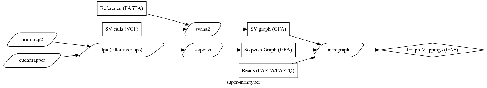
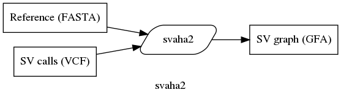
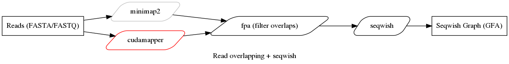

# Fast SV graph analysis on GPUs :fire: / in The Cloud :cloud:

```
                                                   _         _  _                             
                                                  (_)       (_)| |                            
 ___  _   _  _ __    ___  _ __  ______  _ __ ___   _  _ __   _ | |_  _   _  _ __    ___  _ __ 
/ __|| | | || '_ \  / _ \| '__||______|| '_ ` _ \ | || '_ \ | || __|| | | || '_ \  / _ \| '__|
\__ \| |_| || |_) ||  __/| |           | | | | | || || | | || || |_ | |_| || |_) ||  __/| |   
|___/ \__,_|| .__/  \___||_|           |_| |_| |_||_||_| |_||_| \__| \__, || .__/  \___||_|   
            | |                                                       __/ || |                
            |_|                                                      |___/ |_|                
```


`super-minityper` is a set of cloud-based workflows for constructing SV graphs and mapping reads to them.

Structural variants frustrate read mapping because aligners
often choose not to map read portions which map very distantly.
Graphs allow incorporating known variants, including large ones,
and then mapping directly to these. While this has been shown to reduce reference bias and improve
read mappings when a sample contains variants in the graph,
constructing graph genomes and operating on them
has historically been difficult and time-consuming.

We present a set of cloud-based workflows &mdash; composed mostly of preexisting and optimized tools &mdash; to
construct graphs containing structural variants and map reads to them. These workflows allow users to take
arbitrary SV calls, construct a graph, and map reads to these graphs. This workflow prioritizes ease-of-use and
speed, ingesting common input formats and returning results in minutes on commodity cloud VMs.

## Implementation
`super-minityper` is implemented as a DNAnexus cloud applet. There are analgous WDL files for performing all analyses as well.

The general workflow(s) are outlined in the below figure:


A graph can be constructed from either a FASTA reference genome and structural variant calls (in the VCF format) or
a set of long reads, which are aligned and assembled using read-read pairwise alignment and the [seqwish variation graph inducer](https://github.com/ekg/seqwish).

## Docker images:

### ncbicodeathons/superminityper:0.1-cpu

The image includes the following tools:
- [minimap2](https://github.com/lh3/minimap2)
- [minigraph](https://github.com/lh3/minigraph)
- [seqwish](https://github.com/ekg/seqwish)
- [svaha2](https://github.com/edawson/svaha2)
- [fpa](https://github.com/natir/fpa)

Dockerfile is available at [here](https://github.com/NCBI-Codeathons/super-minityper/blob/master/build/docker/Dockerfile)

**Build from source code**

```bash
VERSION=0.1
docker build -t ncbicodeathons/superminityper:${VERSION}-cpu -f build/docker/Dockerfile --target super-minityper-cpu .
```

### ncbicodeathons/superminityper:0.1

In addition to above tools, this image also includes NVIDIA's GPU-accelerated tools that are available from [Clara Genomics Analysis SDK](https://developer.nvidia.com/Clara-Genomics) and [racon-gpu](https://github.com/clara-genomics/racon-gpu)

Note: the tools are compiled with CUDA v10.0 and [nvidia-docker](https://github.com/NVIDIA/nvidia-docker) is required to run the image.

- [cudamapper](https://github.com/clara-genomics/ClaraGenomicsAnalysis#cudamapper)
- [racon](https://github.com/clara-genomics/racon-gpu#usage)
- [racon_wrapper](https://github.com/clara-genomics/racon-gpu#usage)
- assembly_evaluator
- genome_simulator
- racon_test

In Python, you can import claragenomics modules:

```python
from claragenomics.io import fastaio
help(fastaio.write_fasta)

# write_fasta(seqs, filepath, gzip_compressed=False)
#     Writes a fasta file for sequences.

#     Args:
#       seqs: list of 2-tuples containnig sequnces and their names, e.g [('seq1', 'ACGTC...'),
#  ('seq2', 'TTGGC...'), ...]]
#       filepath: path to file for writing out FASTA.
#       gzip_compressed bool: If True then the read component of the sequence has been compres
# sed with gzip

#     Returns:
#       None.
```

Dockerfile is available at [here](https://github.com/NCBI-Codeathons/super-minityper/blob/master/build/docker/Dockerfile)

**Build from source code**

```bash
VERSION=0.1
docker build -t ncbicodeathons/superminityper:${VERSION} -f build/docker/Dockerfile --build-arg CUDA_VERSION=10.0 .
```


### ncbicodeathons/superminityper:dx-wdl-builder-1.0

This image enables easy to use DNANexus's [dxWDL](https://github.com/dnanexus/dxWDL) compiler

**Build from source code**

```bash
DXWDL_VERSION=1.32
DXTOOLKIT_VERSION=0.288.0
DXTOOLKIT_PLATFORM=ubuntu-16.04-amd64

docker build -t ncbicodeathons/superminityper:dx-wdl-${DXWDL_VERSION}-${DXTOOLKIT_VERSION} \
    -t ncbicodeathons/superminityper:dx-wdl \
    --build-arg DXWDL_VERSION=${DXWDL_VERSION} \
    --build-arg DXTOOLKIT_VERSION=${DXTOOLKIT_VERSION} \
    --build-arg DXTOOLKIT_PLATFORM=${DXTOOLKIT_PLATFORM} \
    -f build/docker/Dockerfile --target dx-wdl-builder .
```

**Usage**

```bash
docker run -it --name dx-builder -v $(pwd)/wdl:/workspace/wdl ncbicodeathons/superminityper:dx-wdl

# Inside the container:
    source dx-toolkit/environment
    dx login
    PROJECT_ID=<Project ID in DNANexus such as 'project-afQbBk8c5PvdQqQe6gqfX2gz'>
    java -jar dxWDL.jar compile wdl/SuperMiniTyper_Pipeline1.wdl -project ${PROJECT_ID}

# After exit from the container's shell, the container is still there and you can attach the container by executing the following command
docker start dx-builder
docker attach dx-builder

# If you want to create new container, please execute `docker run` command after removing the existing container by the following command:
docker rm dx-builder
```

### Other images

Dockerfile for `erictdawson/base`: https://github.com/edawson/dawdl/blob/master/base/base.Dockerfile

minigraph (dockerhub): `erictdawson/minigraph`

## svaha2: build graphs for SVs in GFA (from FASTA and VCF)
[svaha2](https://github.com/edawson/svaha2) is a C++ tool for quickly generating simple
structural variation graphs from a reference genome and a set of variants a VCF file.
It does this using a construction algorithm that is designed to operate in time linear to the
number of breakpoints. It also prioritizes efficient use of RAM.




source code: https://github.com/edawson/svaha2

The full algorithm is described in the svaha2 repository, but the main innovation is that
pre-calculating the breakpoints (and sorting them) allows one to
generate a graph with a coordinated ID space without requiring caching any of the graph in memory.

The output of svaha2 is a graph described in GFA v1.0.


## minigraph: align reads to GFA graphs
[minigraph](https://github.com/lh3/minigraph) provides an experimental
read-to-graph mapper. We map reads to the GFA v1.0 graph output by svaha2.
This enables fast, push-button read-to-variants alignment with just
a FASTA reference, a VCF containing SVs, and a FASTA/Q readset.

source code: https://github.com/lh3/minigraph

GAF (output) format: https://github.com/lh3/gfatools/blob/master/doc/rGFA.md#the-graph-alignment-format-gaf


## minimap2 + seqwish: build de novo graphs

We use the minimap2 + seqwish flow to generate de novo graphs in the GFA1 format. This serves
as the basis for aligning new reads to a reference graph.




Source code:

minimap2  - https://github.com/lh3/minimap2

seqwish - https://github.com/ekg/seqwish

fpa - https://github.com/natir/fpa

In our workflow, minimap2 generates an all-to-all mapping with alignments to generate a PAF file.

`minimap2 -x ava-pb <.fa.gz> <.fa.gz> -t <threads> -c > out.paf`

The set of overlaps generated by minimap2 is filtered using fpa to drop any overlaps where the alignment
block is less 10kb. This reduces complexity of the graph by getting rid of edges corresponding to small overlaps.

`fpa -i out.paf drop -l 10000 > filtered_out.paf`

The filtered PAF, along with the reads, is then passed into `seqwish` to generate a GFA.

`seqwish -s <.fa.gz> -p filtered_out.paf -g out.gfa -b out.graph -t <threads>`

The WDL files for this pipeline are in [minimap2 WDL](wdl/SuperMiniTyper_minimap2.wdl) and [seqwish WDL](wdl/SuperMiniTyper_seqwish.wdl).

### Future Directions
A GPU accelerated implementation of minimap2 is under development in the Clara Genomics Analysis SDK.

source: https://github.com/clara-genomics/ClaraGenomicsAnalysis

Once the tool is more stable, an alternative pipeline would be replace the `minimap2` step with `cudamapper`
for faster overlap generation.

An experimental WDL file for using `cudamapper` has been made avaialble in [cudamapper WDL](wdl/SuperMiniTyper_cudamapper.wdl).


