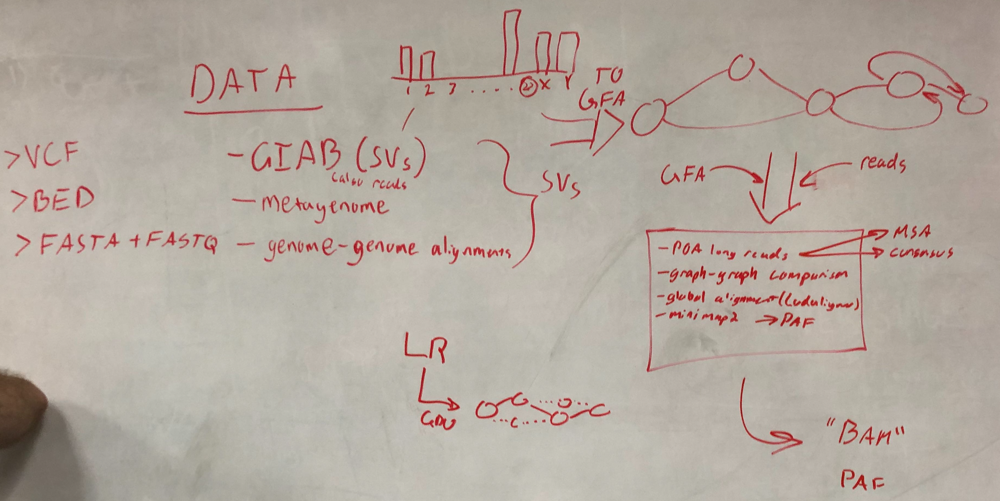

# Graphs on GPUs

TODO: motivation and overall description

## Implementation

TODO: describe implementation

## Docker images:

### ncbicodeathons/superminityper:0.1-cpu

The image includes the following tools:
- [minmap2](https://github.com/lh3/minimap2)
- [minigraph](https://github.com/lh3/minigraph)
- [seqwish](https://github.com/ekg/seqwish)
- [svaha2](https://github.com/edawson/svaha2)
- [fpa](https://github.com/natir/fpa)

Dockerfile is avaialable at [here](https://github.com/NCBI-Codeathons/super-minityper/blob/master/build/docker/Dockerfile)

**Build from source code**

```bash
VERSION=0.1
docker build -t ncbicodeathons/superminityper:${VERSION}-cpu -f build/docker/Dockerfile --target super-minityper-cpu .
```

### ncbicodeathons/superminityper:0.1

In addition to above tools, this image also includes NVIDIA's GPU-accelerated tools that are available from [Clara Genomics Analysis SDK](https://developer.nvidia.com/Clara-Genomics) and [racon-gpu](https://github.com/clara-genomics/racon-gpu)

Note: the tools are compiled with CUDA v10.0 and [nvidia-docker](https://github.com/NVIDIA/nvidia-docker) is required to run the image.

- [cudamapper](https://github.com/clara-genomics/ClaraGenomicsAnalysis#cudamapper)
- [racon](https://github.com/clara-genomics/racon-gpu#usage)
- [racon_wrapper](https://github.com/clara-genomics/racon-gpu#usage)
- assembly_evaluator
- genome_simulator
- racon_test

In Python, you can import claragenomics modules:

```python
from claragenomics.io import fastaio
help(fastaio.write_fasta)

# write_fasta(seqs, filepath, gzip_compressed=False)
#     Writes a fasta file for sequences.

#     Args:
#       seqs: list of 2-tuples containnig sequnces and their names, e.g [('seq1', 'ACGTC...'),
#  ('seq2', 'TTGGC...'), ...]]
#       filepath: path to file for writing out FASTA.
#       gzip_compressed bool: If True then the read component of the sequence has been compres
# sed with gzip

#     Returns:
#       None.
```

Dockerfile is avaialable at [here](https://github.com/NCBI-Codeathons/super-minityper/blob/master/build/docker/Dockerfile)

**Build from source code**

```bash
VERSION=0.1
docker build -t ncbicodeathons/superminityper:${VERSION} -f build/docker/Dockerfile --build-arg CUDA_VERSION=10.0 .
```


### ncbicodeathons/superminityper:dx-wdl-builder-1.0

This image enables easy to use DNANexus's [dxWDL](https://github.com/dnanexus/dxWDL) compiler

**Build from source code**

```bash
DXWDL_VERSION=1.32
DXTOOLKIT_VERSION=0.288.0
DXTOOLKIT_PLATFORM=ubuntu-16.04-amd64

docker build -t ncbicodeathons/superminityper:dx-wdl-${DXWDL_VERSION}-${DXTOOLKIT_VERSION} \
    -t ncbicodeathons/superminityper:dx-wdl \
    --build-arg DXWDL_VERSION=${DXWDL_VERSION} \
    --build-arg DXTOOLKIT_VERSION=${DXTOOLKIT_VERSION} \
    --build-arg DXTOOLKIT_PLATFORM=${DXTOOLKIT_PLATFORM} \
    -f build/docker/Dockerfile --target dx-wdl-builder .
```

**Usage**

```bash
docker run -it --name dx-builder -v $(pwd)/wdl:/workspace/wdl ncbicodeathons/superminityper:dx-wdl

# Inside the container:
    source dx-toolkit/environment
    dx login
    PROJECT_ID=<Project ID in DNANexus such as 'project-afQbBk8c5PvdQqQe6gqfX2gz'>
    java -jar dxWDL.jar compile wdl/SuperMiniTyper_Pipeline1.wdl -project ${PROJECT_ID}

# After exit from the container's shell, the container is still there and you can attach the container by executing the following command
docker start dx-builder
docker attach dx-builder

# If you want to create new container, please execute `docker run` command after removing the existing container by the following command:
docker rm dx-builder
```

### Other images

Dockerfile for `erictdawson/base`: https://github.com/edawson/dawdl/blob/master/base/base.Dockerfile

minigraph (dockerhub): `erictdawson/minigraph`

## svaha2: build graphs for SVs in GFA (from FASTA and VCF)

TODO: description of tool

source code: https://github.com/edawson/svaha2
Docs are in README and in Eric Dawson's brain.

TODO: Download Eric Dawson's brain

Output should be GFA1. Easily converted to GFA2 with https://github.com/edawson/gfakluge

## minimap2 + seqwish: build de novo graphs

We use the minimap2 + seqwish flow to generate de novo graphs in the GFA1 format. This serves
as the basis for aligning new reads to a reference graph.

Source code:

minimap2  - https://github.com/lh3/minimap2

seqwish - https://github.com/ekg/seqwish

fpa - https://github.com/natir/fpa

In our workflow, minimap2 generates an all-to-all mapping with alignments to generate a PAF file.

`minimap2 -x ava-pb <.fa.gz> <.fa.gz> -t <threads> -c > out.paf`

The set of overlaps generated by minimap2 is filtered using fpa to drop any overlaps where the alignment
block is less 10kb. This reduces complexity of the graph by getting rid of edges corresponding to small overlaps.

`fpa -i out.paf drop -l 10000 > filtered_out.paf`

The filtered PAF, along with the reads, is then passed into `seqwish` to generate a GFA.

`seqwish -s <.fa.gz> -p filtered_out.paf -g out.gfa -b out.graph -t <threads>`

The WDL files for this pipeline are in [minimap2 WDL](wdl/SuperMiniTyper_minimap2.wdl) and [seqwish WDL](wdl/SuperMiniTyper_seqwish.wdl).

### Future Direction
A GPU accelerated implementation of minimap2 is under development in the Clara Genomics Analysis SDK.

source: https://github.com/clara-genomics/ClaraGenomicsAnalysis

Once the tool is more stable, an alternative pipeline would be replace the `minimap2` step with `cudamapper`
for faster overlap generation.

An experimental WDL file for using `cudamapper` has been made avaialble in [cudamapper WDL](wdl/SuperMiniTyper_cudamapper.wdl).

## minigraph: map reads to graph

TODO: description of tool

source code: https://github.com/lh3/minigraph

GAF (output) format: https://github.com/lh3/gfatools/blob/master/doc/rGFA.md#the-graph-alignment-format-gaf

## GAF analysis
Once we have the GAF output (alignments of reads to a graph), we do some basic analysis of the contents of the GAF
file using scripts under the `analysis` folder.

We are starting with simple counts such as number of alignments, and a breakdown of how well the queries are aligned
to the graph in each alignment.

The `gaf.py` script can be extended to understand the GAF structure in more depth.

## Workflow




